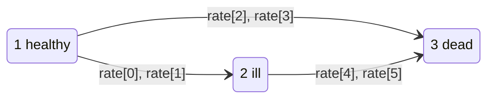

# Illness-death, intervals (CMM)

`model="cmm"` — the illness-death process, returned as **counting-process
intervals**: one row per transition a subject was at risk of.

Three states: **1 healthy**, **2 ill**, **3 dead**. A subject starts healthy and
either falls ill first (`1 → 2`, then possibly `2 → 3`) or dies directly
(`1 → 3`).



Want the same process as a panel of observed states instead? Use
[THMM](thmm.md).

## The model

Each transition has a latent time drawn from a Weibull-type inversion:

$$
T_{ij} = \left(\frac{-\log(1 - U)}{\lambda_{ij}\exp(\beta_{ij} X)}\right)^{1/\rho_{ij}},
\qquad U \sim \mathrm{Uniform}(0,1)
$$

so each transition gets a **pair** of parameters — an intensity $\lambda_{ij}$
and a shape $\rho_{ij}$ — plus one coefficient $\beta_{ij}$. With
$\rho_{ij} = 1$ the sojourn is exponential and $\lambda_{ij}$ is the intensity
directly.

A subject leaves state 1 at $\min(T_{12}, T_{13})$, going wherever came first.
If censoring beats both, it stays in state 1.

!!! note "It is semi-Markov, not Markov"

    The `2 → 3` sojourn is drawn on a **reset clock**: the row spans $t_{12}$ to
    $t_{12} + t_{23}$ where $t_{23}$ is an independent draw, so the intensity of
    dying depends on time since falling ill, not on time since entry. This
    matches `genCMM` in the R package.

## Parameters

```python
gen_cmm(n, model_cens, cens_par, beta, covariate_range, rate, seed=None)
```

| Parameter | Type | Constraint | Meaning |
|---|---|---|---|
| `n` | `int` | > 0 | number of subjects — **not** the number of rows |
| `model_cens` | `str` | `"uniform"` or `"exponential"` | censoring mechanism |
| `cens_par` | `float` | > 0 | censoring parameter |
| `beta` | `Sequence[float]` | **exactly 3** | one coefficient per transition: `1→2`, `1→3`, `2→3` |
| `covariate_range` | `float` | > 0 | `X0` drawn from `Uniform(0, covariate_range)` |
| `rate` | `Sequence[float]` | **exactly 6** | three (intensity, shape) pairs, in transition order |
| `seed` | `int` \| `Generator` \| `None` | — | reproducibility |

`rate` unpacks as:

| Position | Symbol | Transition |
|---|---|---|
| `rate[0]`, `rate[1]` | $\lambda_{12}$, $\rho_{12}$ | `1 → 2` |
| `rate[2]`, `rate[3]` | $\lambda_{13}$, $\rho_{13}$ | `1 → 3` |
| `rate[4]`, `rate[5]` | $\lambda_{23}$, $\rho_{23}$ | `2 → 3` |

Wrong lengths fail loudly rather than being silently truncated:

```text
LengthError: Argument 'rate' must be a sequence of length 6; got length 4.
Adjust the number of elements. (while validating inputs for model 'cmm')
```

## Example

```python
from gen_surv import generate

df = generate(model="cmm", n=6, model_cens="exponential", cens_par=2.0,
              beta=[0.1, 0.2, 0.3], covariate_range=1.0,
              rate=[0.1, 1.0, 0.2, 1.0, 0.1, 1.0], seed=42)
print(df.head(6))
```

```text
 id  start     stop  from_state  to_state  status       X0
  0    0.0 2.819921           1         2       0 0.773956
  0    0.0 2.819921           1         3       0 0.773956
  1    0.0 4.574156           1         2       0 0.438878
  1    0.0 4.574156           1         3       1 0.438878
  2    0.0 0.158588           1         2       0 0.858598
  2    0.0 0.158588           1         3       0 0.858598
```

Read subject `1`: it was at risk of both `1 → 2` and `1 → 3` over
`[0, 4.574)`, and the `1 → 3` row carries `status = 1`, so it died without
falling ill. Subject `0` has `status = 0` on both rows — censored while still
healthy.

Six subjects, thirteen rows. **Never use `len(df)` as a sample size:**

```python
df["id"].nunique()      # 6
len(df)                 # 13
```

## Check: do the intensities come back?

Set every shape to 1 so the sojourns are exponential, and zero the coefficients
so the intensity is the same for everyone. Then each transition's MLE is events
divided by time at risk — which the frame gives you directly, because that is
what the interval columns are for:

```python
from gen_surv import generate

rate = [0.3, 1.0, 0.2, 1.0, 0.5, 1.0]
df = generate(model="cmm", n=40000, model_cens="uniform", cens_par=60.0,
              beta=[0.0, 0.0, 0.0], covariate_range=1.0, rate=rate, seed=7)

for (fs, ts), true_l in zip([(1, 2), (1, 3), (2, 3)], [rate[0], rate[2], rate[4]]):
    rows = df[(df["from_state"] == fs) & (df["to_state"] == ts)]
    exposure = float((rows["stop"] - rows["start"]).sum())
    print(f"{fs}->{ts}  declared={true_l}  mle={int(rows['status'].sum()) / exposure:.3f}")
```

```text
1->2  declared=0.3  mle=0.298
1->3  declared=0.2  mle=0.199
2->3  declared=0.5  mle=0.504
```

## Fitting a transition-specific model

The layout is already what a stratified Cox model wants — one stratum per
transition, with `(start, stop]` intervals:

```python
from lifelines import CoxPHFitter

trans_12 = df[(df["from_state"] == 1) & (df["to_state"] == 2)]
fit = CoxPHFitter().fit(trans_12[["stop", "status", "X0"]],
                        duration_col="stop", event_col="status")
```

For `2 → 3`, remember the clock resets: use `stop - start` as the duration, not
`stop`.

## Related

- [Illness-death, panel (THMM)](thmm.md) — the same process, observed states
- [Output schemas](../getting-started/schemas.md#cmm-counting-process-intervals) — every column
- [Competing risks](competing-risks.md) — `1 → 2` versus `1 → 3` is itself a competing-risks problem
- API: [`gen_cmm`](../api/generators.md#gen_surv.cmm.gen_cmm)
