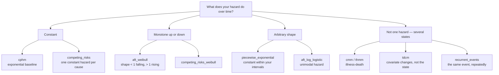

# Choosing a model

Twelve generators, grouped by the question they answer.

## Decide by what you are testing

| If you need… | Use | Why |
|---|---|---|
| A hazard ratio to recover | [`cphm`](cphm.md) | The textbook proportional-hazards setup, one covariate, one coefficient |
| Covariate effects on *time* rather than hazard | [`aft_ln`, `aft_weibull`, `aft_log_logistic`](aft.md) | Accelerated failure time: covariates scale the event time directly |
| A baseline hazard that changes shape over follow-up | [`piecewise_exponential`](piecewise-exponential.md) | Constant hazard within intervals you choose |
| More than one kind of failure | [`competing_risks`, `competing_risks_weibull`](competing-risks.md) | Cause-specific hazards; `status` records which cause won |
| A subpopulation that never fails | [`mixture_cure`](mixture-cure.md) | Logistic cure component plus exponential failure, with a ground-truth `cured` flag |
| An illness-death process, as risk intervals | [`cmm`](cmm.md) | Counting-process rows, one per transition at risk |
| An illness-death process, as observed states | [`thmm`](thmm.md) | Panel of state observations at times |
| An exposure that changes during follow-up | [`tdcm`](tdcm.md) | Cox model with a covariate that switches value mid-follow-up |
| The same event happening more than once | [`recurrent_events`](recurrent-events.md) | Andersen-Gill and Prentice-Williams-Peterson processes |

## Decide by hazard shape



## The parameter each model is "about"

Every page ends with a check that the parameter comes back out. This table is
the short version of what to feed an estimator:

| Model | The truth you set | How you would check it |
|---|---|---|
| `cphm` | `beta` — log hazard ratio | Fit a Cox model, compare the coefficient |
| `aft_*` | `beta` — effect on log time | Regress `log(time)` on the covariates, or fit an AFT model |
| `piecewise_exponential` | `hazard_rates` per interval | Events divided by exposure within each interval |
| `competing_risks*` | one `betas` row per cause | Cause-specific Cox model per cause |
| `mixture_cure` | `cure_fraction` | `cure_fraction_estimate`, or the plateau of the KM curve |
| `cmm` / `thmm` | `rate` per transition | Transitions divided by time at risk in the origin state |
| `tdcm` | `beta` — baseline and time-dependent effects | Cox model on the `(start, stop]` frame |
| `recurrent_events` | `betas`, and `stratum_effects` for PWP | Time-varying Cox on the `(start, stop]` frame |

## They all share these arguments

| Argument | Meaning |
|---|---|
| `n` | number of subjects — positive integer |
| `model_cens` | `"uniform"` or `"exponential"` — see [Censoring](../guides/censoring.md) |
| `cens_par` | the censoring distribution's parameter — positive |
| `seed` | integer or `numpy.random.Generator` — see [Reproducibility](../getting-started/reproducibility.md) |

Everything else is model-specific and documented on that model's page.

## Calling them

Two equivalent styles:

=== "Through `generate()`"

    ```python
    from gen_surv import generate

    df = generate(model="cphm", n=100, beta=0.5, covariate_range=2.0,
                  model_cens="uniform", cens_par=1.0, seed=42)
    ```

=== "The generator directly"

    ```python
    from gen_surv import gen_cphm

    df = gen_cphm(n=100, beta=0.5, covariate_range=2.0,
                  model_cens="uniform", cens_par=1.0, seed=42)
    ```

`generate()` is a thin dispatcher: it looks the name up and forwards your
keyword arguments unchanged. Use it when the model is chosen at runtime, and
the direct function when it is not — the direct function gives you a real
signature, so your editor and type checker can help.

An unknown name fails immediately with the list of valid ones:

```python
generate(model="weibull")
```

```text
ChoiceError: Argument 'model' must be one of 'aft_ln', 'aft_log_logistic',
'aft_weibull', 'cmm', 'competing_risks', 'competing_risks_weibull', 'cphm',
'mixture_cure', 'piecewise_exponential', 'recurrent_events', 'tdcm', 'thmm';
got 'weibull' of type str. Choose a valid option.
```

Model-specific validation says which model it was checking, which matters when
`generate()` was called with a name from a config file:

```text
LengthError: Argument 'beta' must be a sequence of length 3; got length 2.
Adjust the number of elements. (while validating inputs for model 'thmm')
```
