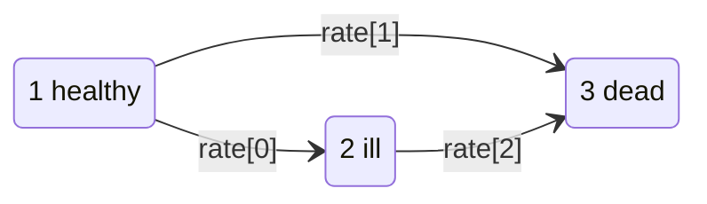

# Illness-death, panel (THMM)

`model="thmm"` — the same three-state illness-death process as
[CMM](cmm.md), returned as a **panel of observed states**: one row each time the
subject's state is recorded.

"Time-homogeneous" means every transition intensity is constant in time. The
states are observed, so despite the name this is **not** a hidden Markov model.



## The model

For covariate $X$, the intensity of the $i \to j$ transition is

$$
\alpha_{ij}(t \mid X) = \lambda_{ij}\exp(\beta_{ij}X),
$$

constant in $t$. Every candidate sojourn is therefore exponential:

$$
T_{ij} \mid X \sim \mathrm{Exponential}\big(\lambda_{ij}\exp(\beta_{ij}X)\big).
$$

A subject leaves state 1 at $\min(T_{12}, T_{13})$ and goes wherever came
first. If censoring arrives before that, it is recorded still in state 1.

Compared with [CMM](cmm.md): CMM's sojourns are Weibull with a shape parameter
per transition and are semi-Markov; THMM's are exponential and memoryless.

## Parameters

```python
gen_thmm(n, model_cens, cens_par, beta, covariate_range, rate, seed=None)
```

| Parameter | Type | Constraint | Meaning |
|---|---|---|---|
| `n` | `int` | > 0 | number of subjects — **not** the number of rows |
| `model_cens` | `str` | `"uniform"` or `"exponential"` | censoring mechanism |
| `cens_par` | `float` | > 0 | censoring parameter |
| `beta` | `Sequence[float]` | **exactly 3** | coefficients for `1→2`, `1→3`, `2→3` |
| `covariate_range` | `float` | > 0 | `X0` drawn from `Uniform(0, covariate_range)` |
| `rate` | `Sequence[float]` | **exactly 3** | intensities $\lambda_{12}$, $\lambda_{13}$, $\lambda_{23}$ |
| `seed` | `int` \| `Generator` \| `None` | — | reproducibility |

Three rates here against CMM's six: THMM has no shape parameters, because
constant intensities are the whole idea.

## Example

```python
from gen_surv import generate

df = generate(model="thmm", n=6, model_cens="exponential", cens_par=2.0,
              beta=[0.1, 0.2, 0.3], covariate_range=1.0,
              rate=[0.2, 0.3, 0.4], seed=42)
print(df.head(6))
```

```text
   id      time  state        X0
0   1  0.000000      1  0.773956
1   1  1.104706      3  0.773956
2   2  0.000000      1  0.438878
3   2  0.469504      3  0.438878
4   3  0.000000      1  0.858598
5   3  0.158588      1  0.858598
```

Every subject opens with an entry observation in state 1 at time 0. Subject `1`
is then observed in state 3 at `t = 1.105` — dead, without ever being ill.
Subject `3`'s second row is still state 1, so it was censored while healthy.

!!! warning "There is no `status` column"

    Whether a subject was censored is read off its **last state**: 3 is
    absorbing, so a final state of 3 is a death and anything else is censoring.

    ```python
    last = df.sort_values("time").groupby("id").last()
    died = last["state"] == 3
    ```

    Note also that `id` starts at **1** here, while `cmm` and the single-row
    models start at 0.

## Check: do the intensities come back?

Zero the coefficients so every subject shares the same intensities, then count
transitions against time at risk in the origin state:

```python
from gen_surv import generate

rate = [0.2, 0.3, 0.4]
df = generate(model="thmm", n=40000, model_cens="uniform", cens_par=60.0,
              beta=[0.0, 0.0, 0.0], covariate_range=1.0, rate=rate, seed=7)

df = df.sort_values(["id", "time"], kind="stable")
second = df.groupby("id").nth(1)          # first observation after entry
exposure1 = float(second["time"].sum())   # entry is at time 0 for everyone

print(f"1->2  declared={rate[0]}  mle={int((second['state'] == 2).sum()) / exposure1:.3f}")
print(f"1->3  declared={rate[1]}  mle={int((second['state'] == 3).sum()) / exposure1:.3f}")
```

```text
1->2  declared=0.2  mle=0.203
1->3  declared=0.3  mle=0.300
```

The `2 → 3` intensity needs the sojourn in state 2 — the gap between the second
and third observations for subjects that fell ill — and comes back at 0.403
against a declared 0.4.

!!! tip "Count the exposure, not the subjects"

    A common mistake is to divide transitions by the number of subjects rather
    than by time at risk. That gives a probability, not an intensity, and it
    will not match `rate`.

## Which of CMM and THMM should you use?

| | `cmm` | `thmm` |
|---|---|---|
| Layout | `(start, stop]` intervals per transition at risk | states observed at times |
| Sojourn distribution | Weibull (shape per transition) | exponential |
| Markov property | semi-Markov — clock resets on entering state 2 | Markov — memoryless |
| `rate` length | 6 (intensity, shape per transition) | 3 (intensity per transition) |
| Censoring indicator | `status` column | inferred from the last state |
| Natural estimator | stratified Cox / Aalen-Johansen on intervals | multi-state Markov likelihood, e.g. R's `msm` |

Use `cmm` when your estimator wants risk intervals, `thmm` when it wants the
state process. The split mirrors `genCMM` and `genTHMM` in the R package.

## Related

- [Illness-death, intervals (CMM)](cmm.md)
- [Output schemas](../getting-started/schemas.md#thmm-observed-state-panel)
- API: [`gen_thmm`](../api/generators.md#gen_surv.thmm.gen_thmm)
